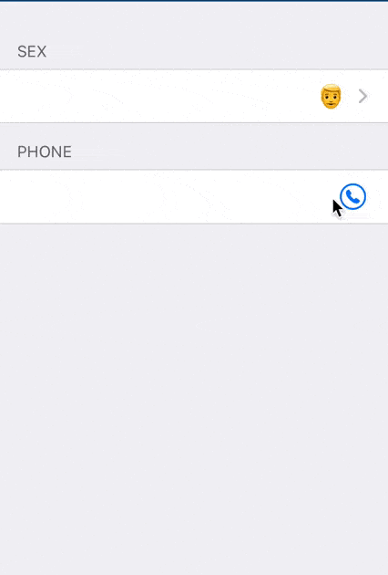

# PhoneContactRow

Prototype of action parameter row for phone with a picker to get phone from contacts



## How it work

### If integrated using 4D (not possible now v19R2, 19R3 or R4?)

[`manifest.json`](manifest.json) define
- an application service to inject, the `PhoneContactRowService`.
  - This service provide the [Eureka](https://github.com/xmartlabs/Eureka) row for `"phoneContact"` name.
     - The row is `PhoneContactRow`, which add a picker for contacts phone to standard phone eureka row
- the `contacts` capabilities to allow iOS app to display contacts
  - this will inject in final iOS app the `NSContactsUsageDescription` key for that
- a parameter `inject` to ask 4d to inject source code

### If we want to do without manifest.json but project

Copy `capabilities` json key value of [`manifest.json`](manifest.json) to your project.4dmobileapp. When building an app it will do the same as described before.
(except copying the code)

### If we have to do the job manually

After generating the app

Edit `Xcode/Info.plist` and add

```xml
	<key>NSContactsUsageDescription</key>
	<string>$(PRODUCT_NAME) needs access to the Contacts to let you share it.</string>
```

Edit `Settings/Settings.plist`file and add or modify `application.service`key to add `PhoneContactRowService` service

```xml
	<key>application.services</key>
	<array>
		<string>PhoneContactRowService</string>
	</array>
```

## TODO

- [ ] More code to be sure we ask access to contact, could check if contact allowed, provide a way to open setting if deactivate etc...
